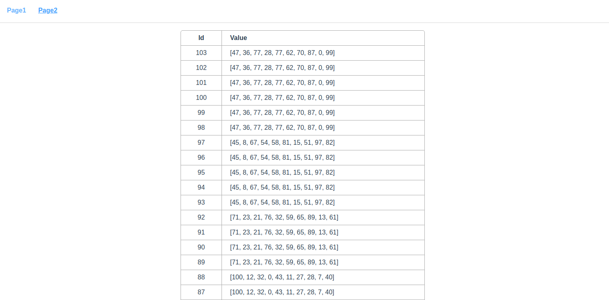

## 数据库
```
sudo docker run --name demo-mysql -e MYSQL_ROOT_PASSWORD=123 -p 3306:3306 -d mysql
```

## 后台

```shell
# 安装 Anaconda及Python依赖
./bin/install.sh init

# 运行
cd web
bin/run.sh
```

## 前端

```shell
cd h5
npm run serve
```

# 效果



